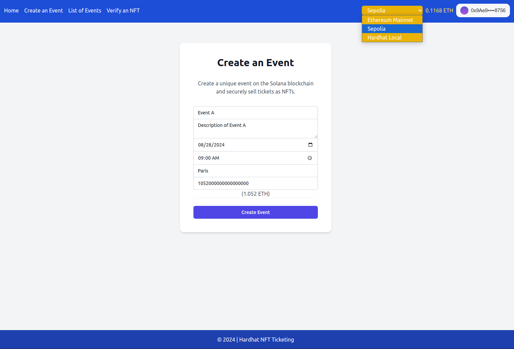

# NFT Ticketing in Solidity / Ethereum / Hardhat

<a href="https://github.com/s-damian/hardhat-nft-ticketing">

</a>
<a href="https://github.com/s-damian/hardhat-nft-ticketing">

</a>
<a href="https://github.com/s-damian/hardhat-nft-ticketing">

</a>

> #Solidity 💎 #Ethereum 🔗 #Hardhat ⚒️ #React ⚛️ #NFT 🖼️ #Web3 🌐

> NFT Marketplace Event Ticketing on the **Ethereum Blockchain**

[](https://github.com/s-damian/hardhat-nft-ticketing/actions/workflows/tests.yml)
[](https://github.com/s-damian/hardhat-nft-ticketing/actions/workflows/static-analysis.yml)
[](./LICENSE)

This **NFT Ethereum Project** is developed by [Stephen Damian](https://github.com/s-damian)

Note: I developed the same project with [Solana / Anchor](https://github.com/s-damian/anchor-nft-ticketing)


## Summary

- [Project Overview](#project-overview)
- [Roadmap](#roadmap)
- [Prerequisites](#prerequisites)
- [Technologies](#technologies)
- [Getting Started (Localnet)](#getting-started-localnet)
- [Transition: Localnet to Testnet](#transition-localnet-to-testnet)
- [Code Structure](#code-structure)
- [Various Documentations](#various-documentations)
- [License](#license)


## Roadmap

- ✅ MetaMask integration.
- ✅ Homepage.
- ✅ Create event.
- ⬜ Event listing.
- ⬜ Buy a ticket.
- ⬜ Generate NFTs.
- ⬜ Verify NFTs.
- ⬜ Integrate other wallets.
- ⬜ Event organizer dashboard.


## Project Overview

NFT Marketplace Event Ticketing - A decentralized application for managing and verifying event tickets as NFTs on the Ethereum blockchain.

**Status**: Under development 🚧



See more images here:
[Images](./img/)


## Prerequisites

- **Node.js** `>= 18` (last tested: `22`) and **npm** (for the Front-End) - *You can install Node.js and npm here: [Node.js](https://nodejs.org/en/download/package-manager).*


## Technologies

- **Back-End**: Solidity `0.8.28`, Ethereum, Hardhat `2.22.x`
- **Front-End**: Next.js `14`, React `18`, TypeScript `5`, Tailwind CSS
- **Blockchain Interaction**: Ethers.js
- **Wallet Integration**: MetaMask


## Getting Started (Localnet)

### Clone the Repository

```bash
git clone https://github.com/s-damian/hardhat-nft-ticketing.git
```


### Go to the Hardhat Directory

```bash
cd /<your-path>/hardhat-nft-ticketing
```


### Install Dependencies

For the Hardhat App:

```bash
npm install
```

For the Next.js App:

```bash
npm install --prefix ./frontend
```


### Environment Setup

- Create a `.env` file (for the Hardhat App):

```bash
cp .env.example .env
```

- Create a `./frontend/.env` file (for the Next.js App):

```bash
cp ./frontend/.env.example ./frontend/.env
```


### Run Hardhat on Local Network

Start a local network with Hardhat:

```bash
npx hardhat node
```


### Make Scripts Executable

Ensure that the shell scripts are executable:

```bash
chmod +x sh/*.sh
```


### Compile and Deploy

Compile contract(s):

```bash
npx hardhat compile
```

Deploy contract(s) on local network:

```bash
npm run deploy localhost
```

(`npm run deploy` calls the sh file `sh/deploy.sh`)

> In the terminal, the contract addresses will be displayed.


### Environment Variables - Contract Addresses

- In the `./frontend/.env` of the Next.js App, you need to configure the following environment variable:

```bash
NEXT_PUBLIC_EVENT_MANAGER_CONTRACT_ADDRESS="<your-event-manager-contract-address>"
```


### MetaMask Wallet

Configure your MetaMask for local development with Hardhat.

> See how to configure MetaMask for local development here: [MetaMask-for-Localnet.md](./docs/MetaMask-for-Localnet.md)


### Run Front-End (Next.js App)

Go to the Next.js App Directory:

```bash
cd /<your-path>/hardhat-nft-ticketing/frontend
```

Start the development server:

```bash
npm run dev
```

Open your browser and go to:

```bash
http://localhost:3000
```


## Transition: Localnet to Testnet

*Preparing for Public Deployment: Transition from Localnet to Sepolia Testnet*

After successfully running your project Locally, the next step is to deploy it to a public Testnet like Sepolia. This section guides you through the process of configuring your environment, deploying your smart contract(s) to the Testnet, and updating your Front-End to interact with the deployed contract(s) on the Testnet.

To switch from the **Localnet** to **Testnet**: [Localnet-to-Testnet.md](./docs/Localnet-to-Testnet.md)


## Code Structure

```bash
.
├── contracts
│   └── [Smart contracts]
├── frontend
│   ├── app
│   │   └── [React pages]
│   ├── src
│   │   ├── components
│   │   │   └── [React components]
│   │   ├── handlers
│   │   │   └── [React handlers]
│   │   └── utils
│   │       └── [React utils]
│   ├── .env
│   ├── package.json
│   └── tailwind.config.ts
├── ignition
│   └── [Ignitions]
├── scripts
│   └── [Scripts]
├── tests
│   └── [Tests]
├── hardhat.config.ts
├── package.json
└── README.md
```


## Various Documentations

- See how to configure MetaMask for local development here:
[MetaMask-for-Localnet.md](./docs/MetaMask-for-Localnet.md)

- To switch from the **Localnet** to **Testnet** (Sepolia):
[Localnet-to-Testnet.md](./docs/Localnet-to-Testnet.md)

- See further technical details here:
[Notes-tech.md](./docs/Notes-tech.md)


## License

This project is licensed under the MIT License. See the [LICENSE](./LICENSE) file for more details.
