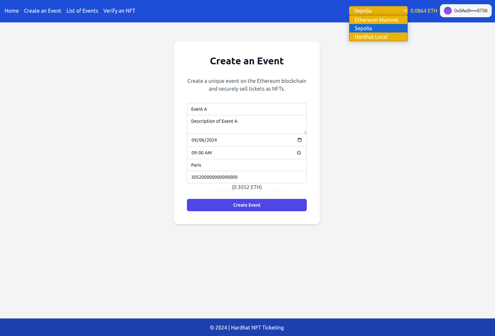

# NFT Ticketing in Solidity / Ethereum / Hardhat

<a href="https://github.com/s-damian/hardhat-nft-ticketing">

</a>
<a href="https://github.com/s-damian/hardhat-nft-ticketing">

</a>
<a href="https://github.com/s-damian/hardhat-nft-ticketing">

</a>

> #Solidity 💎 #Ethereum 🔗 #Hardhat ⚒️ #React ⚛️ #NFT 🖼️ #Web3 🌐

> NFT Marketplace Event Ticketing on the **Ethereum Blockchain**

[](https://github.com/s-damian/hardhat-nft-ticketing/actions/workflows/tests.yml)
[](https://github.com/s-damian/hardhat-nft-ticketing/actions/workflows/static-analysis.yml)
[](./LICENSE)

This **NFT Ethereum Project** is developed by [Stephen Damian](https://github.com/s-damian)

PS: I developed the same project with [Solana / Anchor](https://github.com/s-damian/anchor-nft-ticketing)


## Project Overview

NFT Marketplace Event Ticketing - A decentralized application for managing and verifying event tickets as NFTs on the Ethereum blockchain.

**Status**: Under development 🚧



See more images here:
[Images](./img/)


## Prerequisites

- **Node.js** `>= 18` (last tested: `20`) and **npm** (for the Front-End) - *You can install Node.js and npm here: [Node.js](https://nodejs.org/en/download/package-manager).*


## Technologies

- **Back-End**: Solidity `0.8.24`, Ethereum, Hardhat `2.22.x`
- **Front-End**: Next.js `14`, React `18`, TypeScript `5`, Tailwind CSS
- **Blockchain Interaction**: Ethers.js
- **Wallet Integration**: MetaMask


## Getting Started (Localnet)

### Clone the Repository

```bash
git clone https://github.com/s-damian/hardhat-nft-ticketing.git
```

### Install Dependencies

For the Hardhat App:

```bash
cd /<your-path>/hardhat-nft-ticketing
```

```bash
npm install
```

For the Next.js App:

```bash
cd /<your-path>/hardhat-nft-ticketing/front
```

```bash
npm install
```

### Environment Setup

Create a  ```.env ``` file for the Hardhat App:

```bash
cd /<your-path>/hardhat-nft-ticketing
```

```bash
cp .env.example .env
```

Create a  ```.env ``` file for the Next.js App:

```bash
cd /<your-path>/hardhat-nft-ticketing/front
```

```bash
cp .env.example .env
```

### Run Hardhat Localhost Network

```bash
cd /<your-path>/hardhat-nft-ticketing
```

Start a local network with Hardhat:

```bash
npx hardhat node
```

### Deploy on the local network

```bash
npx hardhat run scripts/deploy.ts --network localhost
```

### Config NEXT_PUBLIC_EVENT_MANAGER_CONTRACT_ADDRESS en var

In the `.env` of the Next.js App part (`/<your-path>/hardhat-nft-ticketing/front/.env` file), you need to configure the `NEXT_PUBLIC_EVENT_MANAGER_CONTRACT_ADDRESS` environment variable.

### Run Front-End (Next.js App):

```bash
cd /<your-path>/hardhat-nft-ticketing/front
```

```bash
npm run dev
```


## Code Structure

```bash
.
├── contracts
│   └── [Smart contracts]
├── front
│   ├── app
│   │   └── [React pages]
│   ├── src
│   │   ├── components
│   │   │   └── [React components]
│   │   ├── handlers
│   │   │   └── [React handlers]
│   │   └── utils
│   │       └── [React utils]
│   ├── .env.local
│   ├── package.json
│   └── tailwind.config.ts
├── ignition
│   └── [Ignitions]
├── scripts
│   └── [Scripts]
├── tests
│   └── [Tests]
├── hardhat.config.ts
├── package.json
└── README.md
```


## License

This project is licensed under the MIT License. See the [LICENSE](./LICENSE) file for more details.
